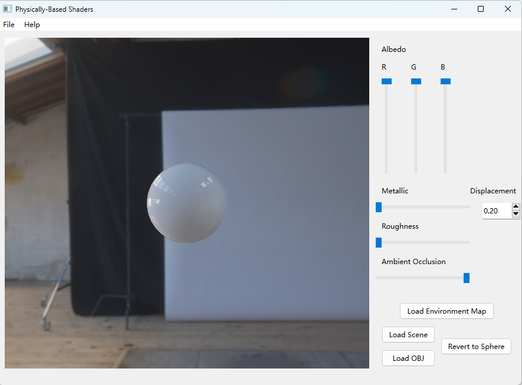
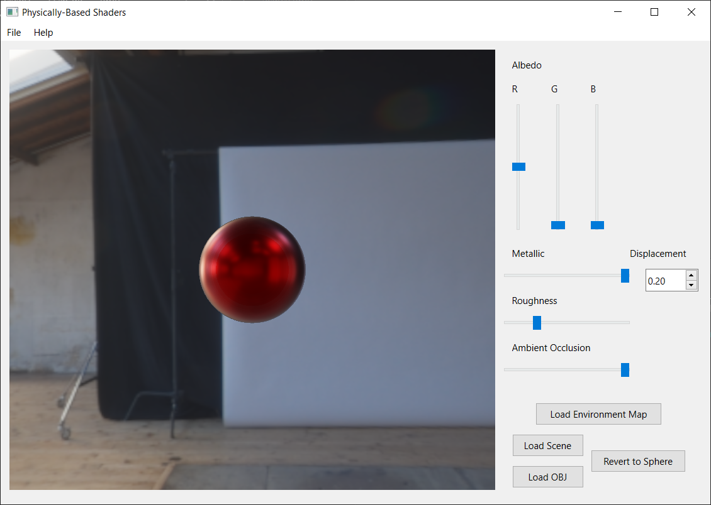
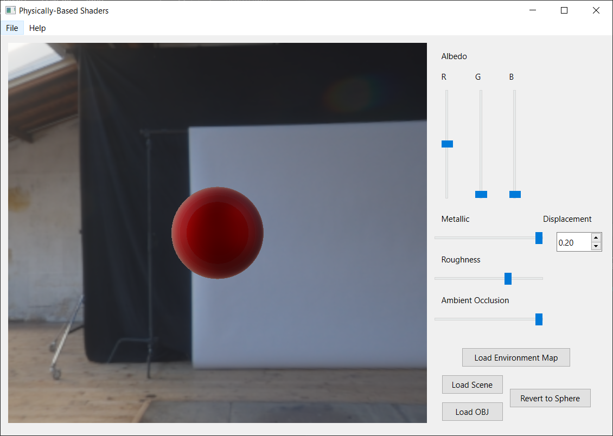

Name: Annie Qiu
Pennkey: annieqiu
======================
Physically-Based Shaders Part II: Environment Maps
======================

My results
------------
0% metallic, 0% rough, RBG = 1 1 1

100% metallic, 0% rough, RGB = 1 1 1

100% metallic, 25% rough, RGB = 1 1 1

cerberus.json

Overview
------------
You will take what you learned in part I of this physically-based shader assignment and
combine it with the pre-computation of irradiance applied to the plastic-metallic BRDF.
Recall that the overall formula for this BSDF is  + 

Here are some example screenshots of what your implementation should look like with varying amounts of roughness and metallicness:

 

 

The Light Transport Equation
--------------
#### Lo(p, &#969;o) = Le(p, &#969;o) + &#8747;S f(p, &#969;o, &#969;i) Li(p, &#969;i) V(p', p) |dot(&#969;i, N)| _d_&#969;i

* __Lo__ is the light that exits point _p_ along ray &#969;o.
* __Le__ is the light inherently emitted by the surface at point _p_
along ray &#969;o.
* __&#8747;S__ is the integral over the sphere of ray
directions from which light can reach point _p_. &#969;o and
&#969;i are within this domain.
* __f__ is the Bidirectional Scattering Distribution Function of the material at
point _p_, which evaluates the proportion of energy received from
&#969;i at point _p_ that is reflected along &#969;o.
* __Li__ is the light energy that reaches point _p_ from the ray
&#969;i. This is the recursive term of the LTE.
* __V__ is a simple visibility test that determines if the surface point _p_' from
which &#969;i originates is visible to _p_. It returns 1 if there is
no obstruction, and 0 is there is something between _p_ and _p_'. This is really
only included in the LTE when one generates &#969;i by randomly
choosing a point of origin in the scene rather than generating a ray and finding
its intersection with the scene.
* The __absolute-value dot product__ term accounts for Lambert's Law of Cosines.